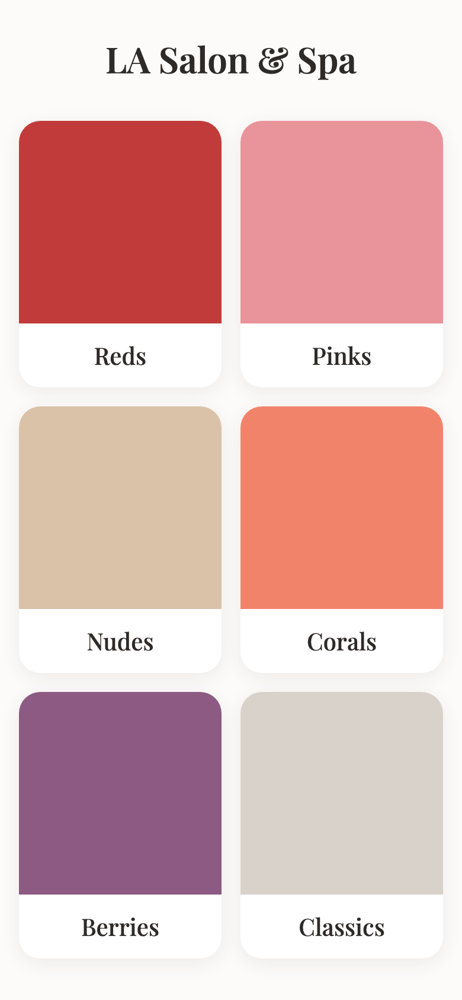
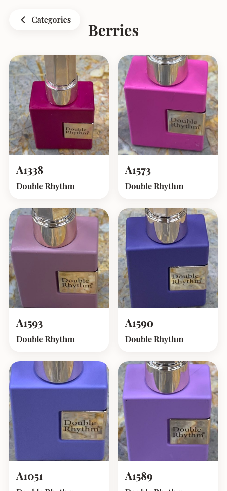
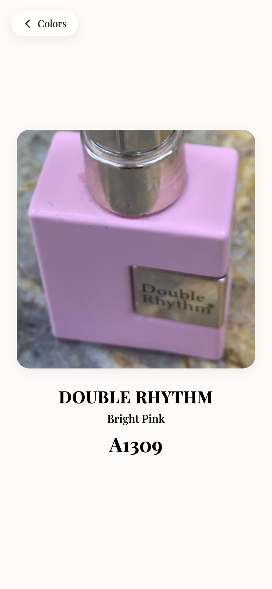

# LA Salon & Spa — Digital Nail Polish Menu

A mobile-first web app that replaces a salon's paper color-swatch binder with a QR-code menu customers browse on their own phone. No accounts, no booking flow, no backend — just a fast, tactile browsing experience: **Categories → Colors → Zoom**.

**Live demo: [salon-menu-jade.vercel.app](https://salon-menu-jade.vercel.app/)**

<p align="center">
  
  
  
</p>

## Highlights

- **Shared-element transitions** — tapping a category or color card animates it directly into the next view via Framer Motion's `layoutId`, rather than a generic fade/slide.
- **Graceful placeholder strategy** — every color renders as a solid swatch until a real photo is supplied; dropping a photo into `public/images/` requires no component changes.
- **Accessible by default** — real `<button>` elements (not `onClick` divs), text-paired color names for colorblind users, and `prefers-reduced-motion` support.
- **Zero backend** — content lives in a single typed data file; the whole app ships as a static bundle.
- **Privacy-conscious analytics** — Vercel Web Analytics counts page views as a proxy for QR scans, with no cookies or third-party trackers.

## Tech Stack

- **[Vite](https://vitejs.dev/)** — build tool and dev server
- **[React](https://react.dev/)** — UI, with simple state-based view switching (no router needed for 3 fixed levels)
- **[Tailwind CSS](https://tailwindcss.com/)** — styling, driven by a small custom design-token palette
- **[Framer Motion](https://www.framer.com/motion/)** — shared-element (`layoutId`) transitions and tap feedback
- **[Vercel Web Analytics](https://vercel.com/docs/analytics)** — lightweight, cookie-free page-view tracking
- **Vercel** — static hosting, no environment variables or serverless functions required

## Architecture

```
src/
  data/colors.js       # all menu content — categories and colors
  components/
    CategoryGrid.jsx   # Level 1 — category grid (home)
    ColorList.jsx       # Level 2 — colors within a category
    ZoomView.jsx        # Level 3 — fullscreen zoom view
    ColorImage.jsx       # image with solid-swatch fallback
    FinishTag.jsx        # Glossy / Matte / Shimmer / Glitter pill
    BackButton.jsx        # persistent back button
  App.jsx               # navigation state + shared-layout view switching
```

Full design system and product spec: [`CLAUDE.md`](CLAUDE.md).

## Running Locally

```bash
npm install
npm run dev
```
