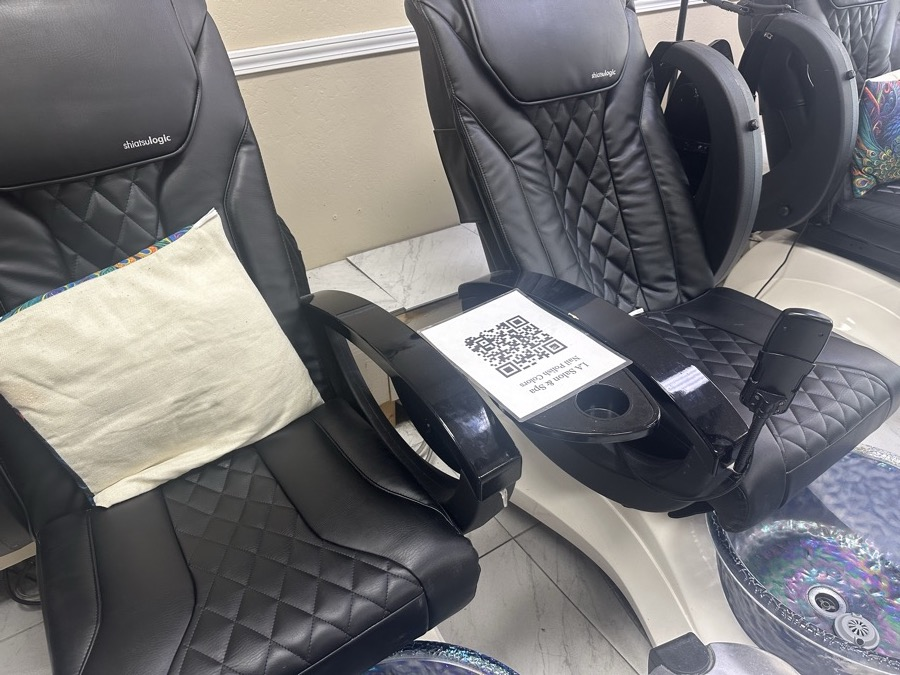

# Digital Nail Polish Menu

Salons hand customers a physical binder of color swatches to flip through, but there's only one binder: while one customer is using it, another has to wait. This app replaces the binder with a QR-code menu customers browse on their own phone: no accounts, no booking flow, no backend, just a scrolling gallery of **30+ interactable cards**, each independently pinch-zoomable, pannable, and rotatable in place. Already used by **450+ unique visitors** scanning the salon's QR code.

## [View Live Demo →](https://salon-menu-jade.vercel.app/)

<table>
<tr>
<td align="center" width="50%">
<b>Collection Gallery</b>  

</td>
<td align="center" width="50%">
<b>QR Code Posted in the Salon</b>  

</td>
</tr>
</table>

## Highlights

- **One screen, no navigation:** every collection is a card in a single scrollable gallery; there's no separate zoom screen or back button to manage.
- **Real pinch/pan/zoom + rotate, per card:** `react-zoom-pan-pinch` handles tap-to-zoom, pinch, and pan on each card's photo independently; a hand-rolled 90°-step rotate button sits in that card's caption row (the library has no rotation API of its own).
- **Scroll never fights zoom:** panning only activates once a card is actually zoomed in, so dragging over an unzoomed card's photo scrolls the page like normal instead of getting captured by the gesture library.
- **Graceful fallback state:** a missing or not-yet-supplied photo falls back to a solid swatch color instead of a broken image. Dropping a real photo into `public/images/collections/` requires no component changes.
- **Accessible by default:** real `<button>` elements (not `onClick` divs), text-paired collection names for colorblind users, and `prefers-reduced-motion` support (applied by hand for the zoom/rotate gestures, since they sit outside Framer Motion).
- **Zero backend:** content lives in a single typed data file; the whole app ships as a static bundle.
- **Privacy-conscious analytics:** Vercel Web Analytics counts page views as a proxy for QR scans, with no cookies or third-party trackers.

## Tech Stack

- **[Vite](https://vitejs.dev/):** build tool and dev server
- **[React](https://react.dev/):** UI, no router or navigation state needed since there's only one screen
- **[Tailwind CSS](https://tailwindcss.com/):** styling, driven by a small custom design-token palette
- **[Framer Motion](https://www.framer.com/motion/):** the gallery's mount fade-in and tap feedback
- **[react-zoom-pan-pinch](https://github.com/BetterTyped/react-zoom-pan-pinch):** pinch/pan/zoom gestures on each card's photo
- **[Vercel Web Analytics](https://vercel.com/docs/analytics):** lightweight, cookie-free page-view tracking
- **Vercel:** static hosting, no environment variables or serverless functions required
